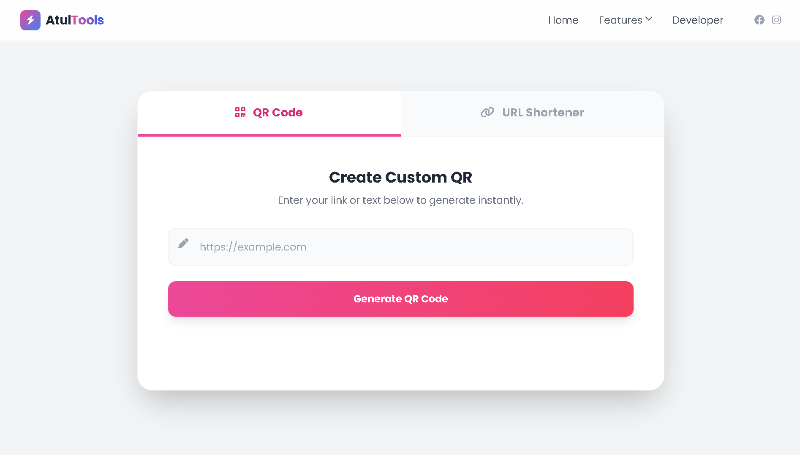
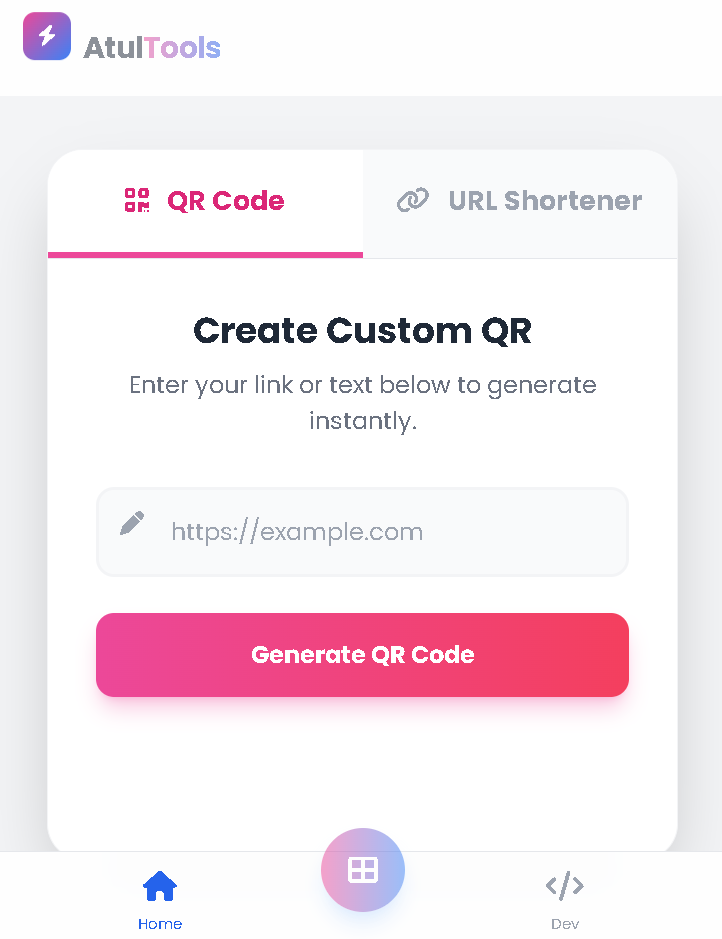

<div align="center">

  

  # 🚀 All-in-One Smart Utility Tool

  <p align="center">
    A premium, responsive web application featuring a <strong>QR Code Generator</strong> and <strong>URL Shortener</strong>.<br>
    Built with a focus on Glassmorphism UI and Mobile-First Experience.
  </p>

  <p align="center">
    <a href="https://atulpaul.vercel.app">View Demo</a> •
    <a href="#-features">Features</a> •
    <a href="#-how-to-run">How To Run</a> •
    <a href="https://github.com/atul-dev-ai">Author</a>
  </p>

  
  
  
  

</div>

---

## 📱 Project Overview

**Atul Tools** is a lightweight, client-side web application designed to solve daily digital problems. It combines a robust **QR Code Generator** and a **URL Shortener** into a single, aesthetically pleasing interface. The design adapts seamlessly from desktop monitors to mobile screens, offering an "App-like" feel on smartphones.

## ✨ Key Features

### 🔹 1. Dynamic QR Code Generator
- Generate high-quality QR codes for any text or URL.
- **Instant Download:** Saves the QR code directly to your device as a `.png` file (bypassing blob/preview issues).
- Real-time loading states and error handling.

### 🔹 2. URL Shortener
- Instantly shorten long, messy URLs using the TinyURL API.
- **One-Click Copy:** Copy the shortened link to your clipboard with a single tap.
- Clean and minimal input interface.

### 🔹 3. Premium UI/UX
- **Glassmorphism Design:** Modern frosted glass effects using Tailwind CSS.
- **Mobile-First Navigation:** Features a sticky bottom tab bar on mobile (like Instagram/TikTok) and a sleek top navbar on desktop.
- **Smooth Animations:** Custom fade-in and slide-up transitions for a polished feel.

---

## 📸 Screenshots

| **Desktop View** | **Mobile View (App Style)** |
|:---:|:---:|
|  |  |

> *https://atul-dev-ai.github.io/QR-code-generator*

---

## 🛠️ Tech Stack

* **Frontend Structure:** HTML5 (Semantic)
* **Styling:** Tailwind CSS (via CDN for lightweight performance)
* **Logic:** Vanilla JavaScript (ES6+)
* **Icons:** FontAwesome 6
* **Fonts:** Poppins (Google Fonts)
* **APIs Used:**
    * `goqr.me` / `qrserver.com` (QR Generation)
    * `tinyurl.com` (URL Shortening)

---

## 🚀 How to Run Locally

Since this project uses **Tailwind CSS via CDN**, you don't need `Node.js` or `npm install`. It's plug-and-play!

1.  **Clone the Repository**
    ```bash
    git clone https://github.com/atul-dev-ai/QR-code-generator.git
    ```

2.  **Navigate to the folder**
    ```bash
    cd QR-code-generator
    ```

3.  **Launch the App**
    * Simply double-click `index.html` to open it in your browser.
    * OR use **Live Server** in VS Code for the best experience.

---

## 📂 Folder Structure

├── `index.html`       # Main application structure.

├── `script.js`        # Logic for QR, URL Shortener, and UI toggles.

├── `style.css`        # (Optional) Custom styles if needed.

└── `README.md`        # Project documentation.

---

## 🤝 Contributing

Contributions are always welcome! If you have any ideas to make this tool better:

1.  Fork the Project
2.  Create your Feature Branch (`git checkout -b feature/AmazingFeature`)
3.  Commit your Changes (`git commit -m 'Add some AmazingFeature'`)
4.  Push to the Branch (`git push origin feature/AmazingFeature`)
5.  Open a Pull Request

---

## 👨‍💻 Author

**Atul Paul**

* **GitHub:** [@atul-dev-ai](https://github.com/atul-dev-ai)
* **Portfolio:** [atulpaul.vercel.app](https://atulpaul.vercel.app)
* **Linkedin:** [paul-atul](https://www.linkedin.com/in/paul-atul)

<p align="center">
  <i>Made with ❤️ and Tailwind CSS.</i>
</p>

📝 How to update it:

**Create File:** In your VS Code, create a file named `README.md`.

**Paste:** Copy the code from the box above and paste it into that file.

**Customization (Optional):**

Remove the links labeled **[Desktop UI Placeholder]** and **[Mobile UI Placeholder]** and replace them with the original screenshot links of your website (if you have them). If you don’t, you can leave the placeholders as they are — that’s completely fine.

Replace `your-username/your-repo-name` with your actual GitHub username and repository name.

**Push:** Then run the following command to update it on GitHub:


```Bash
git add README.md
git commit -m "Added stylish README"
git push origin main
```
